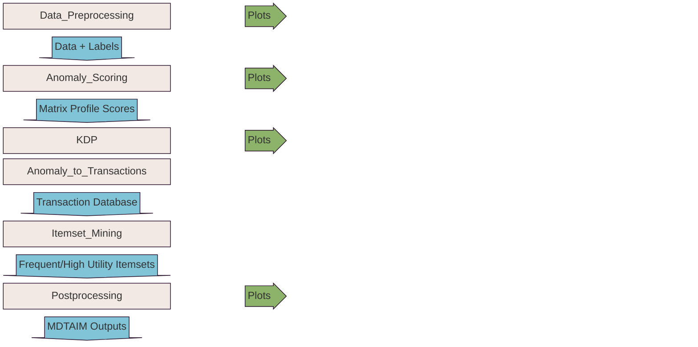
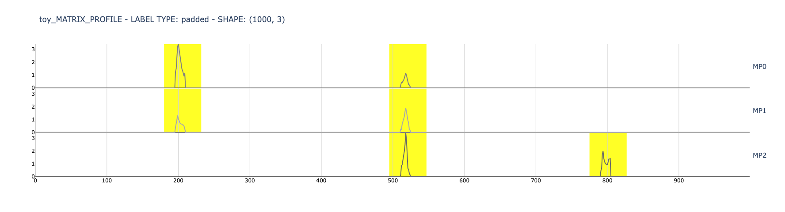
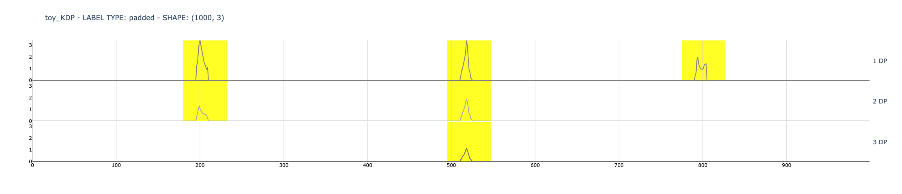

<!-- omit in toc -->
# ⭐ MDTAIM: Multi-Dimensional Time-Series Anomaly Detection and Itemset Mining


[](https://www.python.org/downloads/release/python-390/)
[](https://pypi.org/project/matrixprofile/)
[](https://www.philippe-fournier-viger.com/spmf/)
[](https://github.com/armanbehkish/mdtaim/stargazers)
[](https://github.com/armanbehkish/mdtaim/network)
[](https://github.com/armanbehkish/mdtaim/issues)
[](https://github.com/armanbehkish/mdtaim/blob/master/LICENSE)


<!-- omit in toc -->
## TABLE OF CONTENTS
- [🔍 About](#-about)
- [🔌 Architecture](#-architecture)
- [🛠️ Installation](#️-installation)
- [📊 Dataset](#-dataset)
- [📊 Output](#-output)
  - [CLI Output Example](#cli-output-example)
- [📈 Plots](#-plots)
- [📝 Configuration](#-configuration)
- [📚 Libraries](#-libraries)
- [👤 Authorship \& Citation](#-authorship--citation)
  - [How to Cite](#how-to-cite)
- [📜 License](#-license)


## 🔍 About

This repository is an implementation of a research done to detect multi-dimensional time-series anomalies using a novel method. It builds on top of existing anomaly detection scoring funcitons (Primarily matrix profile) and leveragtes the output as transactions to mine frequent itemsets. We try to investigate the possibility of using current efficient frequent itemset mining algorithms as a fast way to detect multi-dimensional anomalies.

## 🔌 Architecture

This is the High level Architecture of MDTAIM:




## 🛠️ Installation

```bash
# make sure you have poetry installed
poetry --version

# Clone the repository
git clone https://github.com/armanbehkish/mdtaim.git

# Navigate to the directory
cd mdtaim

# install dependencies
poetry install

# activate the virtual environment
poetry shell

# make sure to double check the configuration file in config/config_<dataset>.yaml

# run the code
python main.py

# check the ouputs in /data/output/final
# check the plots in /plots
```

<!-- ## 💻 Usage

Here's a simple example of how to use your project:

```python
from myproject import MyClass

# Create an instance
obj = MyClass()

# Do something
result = obj.do_something()
``` -->

<!-- ## 📊 Demo


You can try the live demo [here](https://demo-link.com) -->

## 📊 Dataset

_Dataset location_: `data/input/raw/<dataset_name>`
- Create the path if doesn't exist
- Put the CSV files of the dataset and the ground truth in the `data/input/raw/` directory under the dataset title/name which is also set in `dataset_title: toy` field in the configuration file!
- Also set the names of the files and the ground truth type in the configuration file like this:

```yaml
data:
  dataset_title: toy
  dataset_file_name: toy_data.csv
  dataset_gt_file_name: toy_data_GT.csv
  ground_truth_type: range
```

## 📊 Output

MDTAIM output includes the dimension numbers and location of N-dimensional anomalies (also the importance score if the algorithms outputs utility). 
_MDTAIM Output location_: `data/output/final/...`  

Raw SPMF algorithm outputs are saved in :
_SPMF AlgorithmsOutput location_: `data/output/spmf/...`

The processed directory includes the intermediate files that can be used to debug.
_Processed data location_: `data/processed/...`

Create the paths if doesn't exist!

### CLI Output Example

CLI output of the program on the pvsystem dataset:

```
2025-12-12 15:12:00,999 - mdtaim.utility - load_config - INFO - Config loaded successfully!
2025-12-12 15:12:01,031 - mdtaim.utility - load_data - INFO - dataset pvsystem_data.csv loaded successfully!
2025-12-12 15:12:01,069 - mdtaim.utility - load_data - INFO - ground truth pvsystem_GT.csv loaded successfully!
2025-12-12 15:12:02,838 - mdtaim.utility - load_data - INFO - anomaly rate of padded labels: 0.048494882600842865
MP calculation:   0%|          | 0/22 [00:00<?, ?it/s]MP calculation: 100%|██████████| 22/22 [00:00<00:00, 304.60it/s]
2025-12-12 15:12:02,949 - mdtaim.utility - calculate_score - INFO - Baseline correction with quantile: 0.65 done!
2025-12-12 15:12:02,949 - mdtaim.utility - cal_anomaly_score - INFO - MP calculation done! total time to calculate Matrix Profile: 0.085 seconds
2025-12-12 15:12:09,316 - mdtaim.utility - plot_single_ts - INFO - Single time series (dimension 20) plotted successfully.
2025-12-12 15:12:10,060 - mdtaim.utility - cal_kdp - INFO -  KDP calculation done! total time to calculate KDP: 2030.09 µs
2025-12-12 15:12:12,830 - mdtaim.utility - convert_anomalies_to_transactions - INFO - Converting anomalies to transactions using beta1 method!
2025-12-12 15:12:12,837 - mdtaim.utility - convert_beta_1 - INFO - Time taken: 6173.55 µs
2025-12-12 15:12:12,837 - mdtaim.utility - convert_anomalies_to_transactions - INFO - time for conversion: 7117.59 µs
2025-12-12 15:12:12,838 - mdtaim.utility - build_transactions - INFO - 3 transactions were created successfully!
2025-12-12 15:12:12,839 - mdtaim.utility - save_transactions_to_file - INFO - current transactions saved to pickle successfully!
2025-12-12 15:12:12,841 - mdtaim.utility - cal_anomaly_detec_accuracy - INFO - number of matches: number of matches: 9 out of 9 detected anomalies for 9 labels
2025-12-12 15:12:12,841 - mdtaim.utility - cal_anomaly_detec_accuracy - INFO - Precision: 1.0, Recall: 1.0, F1 Score: 1.0
2025-12-12 15:12:13,561 - mdtaim.utility - load_transactions_from_file - INFO - transaction DB loaded successfully!
2025-12-12 15:12:13,563 - mdtaim.utility - prepare_transaction_database - INFO - Transaction DB written to file successfully!
2025-12-12 15:12:14,049 - mdtaim.utility - check_java_version - INFO - Found Java version: 23, going on...
2025-12-12 15:12:14,061 - mdtaim.utility - run_algorithm - INFO - Running SPMF: NegFIN algorithm with the command java -jar ./lib/spmfe.jar run NegFIN ./data/processed/transaction_databases/context.txt ./data/output/spmf/NegFIN_pvsystem_out.txt 0.5%...
2025-12-12 15:12:14,334 - mdtaim.utility - run_algorithm - INFO - SPMF Output:
>/Volumes/develop/MsThesis/MDTAIM/lib/spmfe.jar
========== negFIN - STATS ============
 Minsup = 1
 Number of transactions: 3
 Number of frequent  itemsets: 64
 Total time ~: 2169 μs
 Max memory:9.627677917480469 MB
=====================================

2025-12-12 15:12:14,334 - mdtaim.utility - perform_itemset_mining - INFO - MP conversion to transactions took 0.009 seconds and SPMF execution took 0.492 seconds
```

## 📈 Plots

Each step of the pipeline outputs the associated plots in the `plots/` directory. This is the list of plots (for the toy dataset) to be consulted to better understand each step of the pipeline:
- The input dataset:

- the matrix profile scores with padded labels:

- the kdp (from TSADIS to compare):



## 📝 Configuration

Project configuration file: `config/config_<dataset>.yaml`
- create the file if doesn't exist (you can use config_toy.yaml as a template)
- fill in the parameters according to the documentation  
  

    
**GENERAL CONFIGURATION SECTIONS:** 

***Anomaly scoring:*** settings to calculate anomaly scores
```yaml
anomalyscoring:
  which: matrixprofile
  matrixprofile: 
    subsequence_length: 10 
    auto_subsequence_length: False 
  iForest:
    num_trees: 100    
```

***itemset mining:*** settings to convert anomaly scores into transactions

```yaml
itemset_mining_preparation:
  window_size: 10
  ignore_win_smaller_than: 0.5
  windowing_method: energy 
  enable_threshold_tuning: True 
  train_size: 150
  threshold_tuning_step: 0.2
  custom_threshold: 2  
  compare_to_train_for_detection: True 
  cut_baseline: False 
  quantile: 0.8
  utility_function: max  
  cons_trans_chk_for_merge: 4  
```

***SPMF Settings:*** settings to configure the choosen SPMF freauent itemset mining algorithm, not all settings are used for all algorithms, refer to documentation for more details!

```yaml
spmf:
  algorithm: Apriori 
  min_support: 0.5%
  max_support: 1%
  min_support_count: 1 
  max_pattern_length: 3
  min_pattern_length: 1
  show_transaction_ids: False  
  high_utility_itemsets: False
  min_utility: 1
  empty_trans_replacement: 1000
  sort_input_items:
    enable: True 
    ascending: True
  replace_zero:  
    enable: True 
    replace_zero_with: 99
  jar_file: ./lib/spmf.jar
```

***Data Settings:*** settings to prepare the data, set the dataset name here!

```yaml
data:
  dataset_title: toy
  dataset_file_name: toy_data.csv
  dataset_gt_file_name: toy_data_GT.csv
  ground_truth_type: range
  dataset_path: ./data/raw/toy/
  spmf_output_path: ./data/output/spmf/
  final_output_path: ./data/output/final/
  processed_data_path: ./data/processed/
  transactions_path: ./data/processed/saved_transactions/
  scores_path: ./data/processed/saved_scores/
  transaction_db_path: ./data/processed/transaction_databases/
  label_pad_size: 10
```

***Log Settings:*** settings used to configure the logging, Log level and location!

```yaml
logging:
  console_log_level: INFO
  log_dir: ./logs/
  log_file_prefix: dev
```

***Plot Settings:***: configure the plotting output.

```yaml
plot:
  output_path: ./plots/
  subplot_size: 160
  show_dataset: True
  show_matrixprofile: False
  show_kdp: False
  show_detected_anomalies_vs_gt: False
  show_final_output: True
```

## 📚 Libraries

We use [MATRIX PROFILE](https://www.cs.ucr.edu/~eamonn/MatrixProfile.html)  to extract anomaly scores and [SPMF](https://www.philippe-fournier-viger.com/spmf/) for various itemset mining algorithms. Also, some code excerpts were used in the anomaly scoring module from the [TSADIS](https://sites.google.com/view/tsadis) paper implementation.  
 

## 👤 Authorship & Citation

**Author**: Arman Behkish
**Affiliation**: Politecnico di Torino
**Supervisor**: Prof. Luca Cagliero

This repository contains the implementation of the Master's thesis:
**"Multivariate Anomaly Detection Using Frequent Itemset Mining"**
Politecnico di Torino, 2025

**Thesis Document**: [https://webthesis.biblio.polito.it/35359/](https://webthesis.biblio.polito.it/35359/)  
**Embargo Period**: The thesis is under embargo until **11 April 2026**

### How to Cite

If you reference this work, please cite the thesis. GitHub will display citation formats (APA, BibTeX) via the "Cite this repository" button in the sidebar, or you can use the information from the [CITATION.cff](CITATION.cff) file.

**Important**: This code is provided under a restrictive license. Please review the [LICENSE](LICENSE) file before any use. The code may not be used in academic publications, commercial products, or derivative works without explicit permission.

## 📜 License

**Copyright (c) 2025 Arman Behkish. All Rights Reserved.**

This software is provided under a **restrictive proprietary license**. The code is provided for viewing and educational purposes only.

**Prohibited without written permission:**
- Copying, modifying, or redistributing the code
- Using the code or algorithms in academic publications
- Using the code in commercial or industrial products
- Creating derivative works

**Note**: The thesis document on the university portal is licensed under [CC BY-NC-ND 3.0](https://creativecommons.org/licenses/by-nc-nd/3.0/), while this code repository has a separate, more restrictive license.

See the [LICENSE](LICENSE) file for complete terms.
